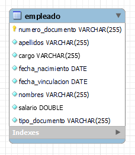

# Apartados técnicos
La aplicación fue desarrollada con el lenguaje de programación Java version 11, se utilizó el framework Spring boot, para construir el proyecto maven, para el apartado de persistencia utilizamos JPA y JPQL con una base de datos MYSQL, para el tema de control de versiones utilizamos git y por último desplegamos el proyecto en Google Cloud utilizando Docker para contenerizar la aplicación.

Se hicieron varios modulos para la aplicacion, uno para la persistencia el cual define nuestras entidades y los repositorios que van hacer las consultas a la base de datos, el modulo negocio que define los servicios de la aplicacion, en este caso el servicio de registrar el empleado y por ultimo el modulo web el cual define las api rest, se creo una api rest para el empleado la cual tiene un metodo POST para registrar el empleado.

El modulo de negocio se le hizo un test con junit para validar el servicio de registrar un empleado y en el modulo de negocio se hizo un test con MockMvc para validar el metodo POST de registrar un empleado.
##Modelo relacional
El modelo cuenta con solo una tabla la cual es el empleado, el atributo cargo y tipo de documento se creo una enumeracion ya que estos datos se van a repetir mucho y sera mucho mas facil hacer consultas teniendo estos campos controlados.

# Funcionalidades

La aplicación cuenta con una api rest la cual nos deja guardar un empleado, esta verifica que el json que reciba se pueda castear al objeto empleado, que los campos no sean nulos, que las cedulas de los empleados no se repitan y que el empleado sea mayor de edad.

# Uso api rest
